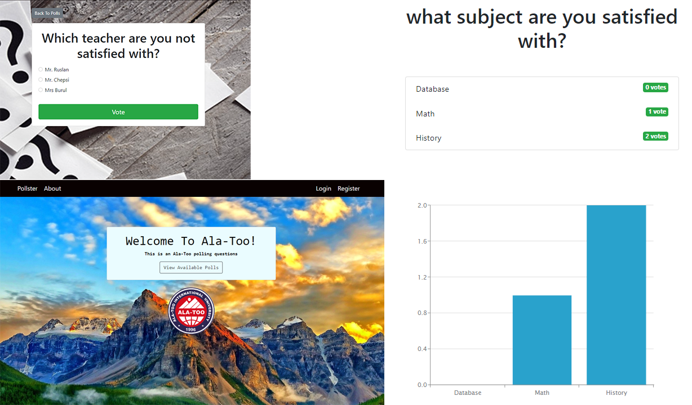
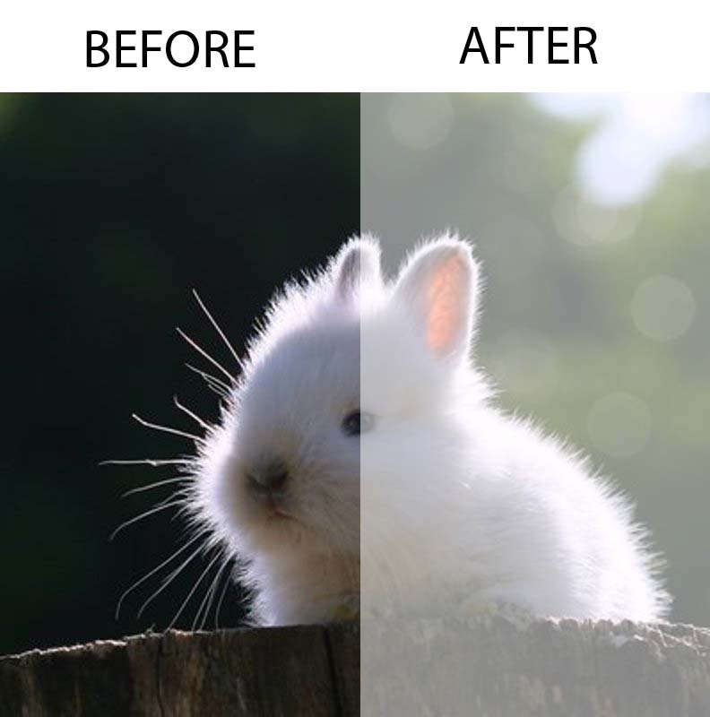
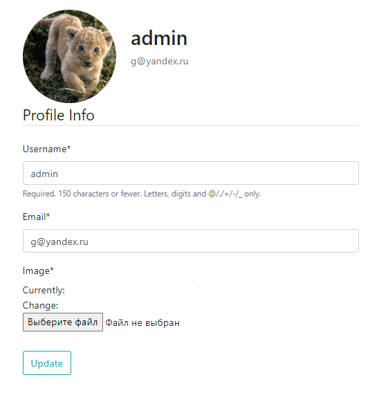

# Pollster
**by Gimaletdinova Gulnaz** 
**MAT-20**

App is allow conducts public opinion polls.

_*Superuser*_

_login: admin_   
_pass: 123_

## About Pollster
This app was created to get the opinion of Ala-Too students. To improve the quality of education and management at the university. The application allows you to create your profile and answer to questions.

## Screeshots

## Photo processing

After clicking on the registration button, all photos in the avatar image folder will be processed.

## Profile

Here you can select a profile photo.

## Sources
Lab work: Pollster(web programing, 2 grade)

Lab work: Registration (web programing, 2 grade)

> [Project: Batch image processing for instagram (programing languages 2, 1 grade)](https://github.com/gulnaz1024/Batch-image-processing-for-instagram)

> [https://docs.djangoproject.com/en/4.0/topics/http/file-uploads/](https://docs.djangoproject.com/en/4.0/topics/http/file-uploads/)

> [https://docs.djangoproject.com/en/3.2/ref/models/options/](https://docs.djangoproject.com/en/3.2/ref/models/options/)

> [https://www.youtube.com/watch?v=KNPq1jg0L1s](https://www.youtube.com/watch?v=KNPq1jg0L1s)

> [https://evileg.com/ru/post/59/](https://evileg.com/ru/post/59/)

> [https://www.cyberforum.ru/python-django/thread2735154.html](https://www.cyberforum.ru/python-django/thread2735154.html)

> [https://docs.djangoproject.com/en/3.1/ref/templates/language/#variables](https://docs.djangoproject.com/en/3.1/ref/templates/language/#variables)

> [https://levelup.gitconnected.com/how-to-implement-login-logout-and-registration-with-djangos-user-model-59442164db73](https://levelup.gitconnected.com/how-to-implement-login-logout-and-registration-with-djangos-user-model-59442164db73)

> [https://dev.to/earthcomfy/django-user-profile-3hik](https://dev.to/earthcomfy/django-user-profile-3hik)

> [https://habr.com/ru/post/126704/](https://habr.com/ru/post/126704/)

> [https://prettyprinted.com/tutorials/creating-a-poll-app-in-django](https://prettyprinted.com/tutorials/creating-a-poll-app-in-django)